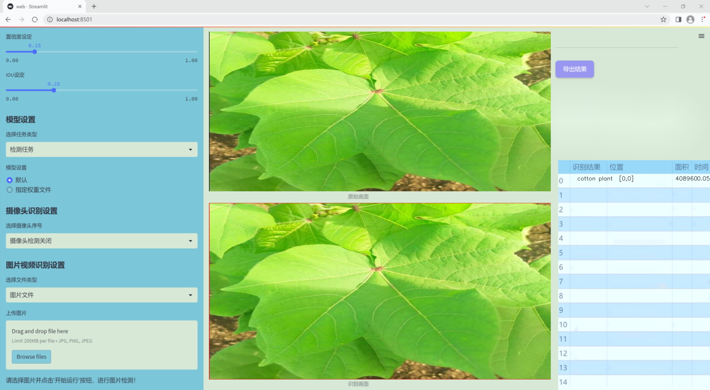
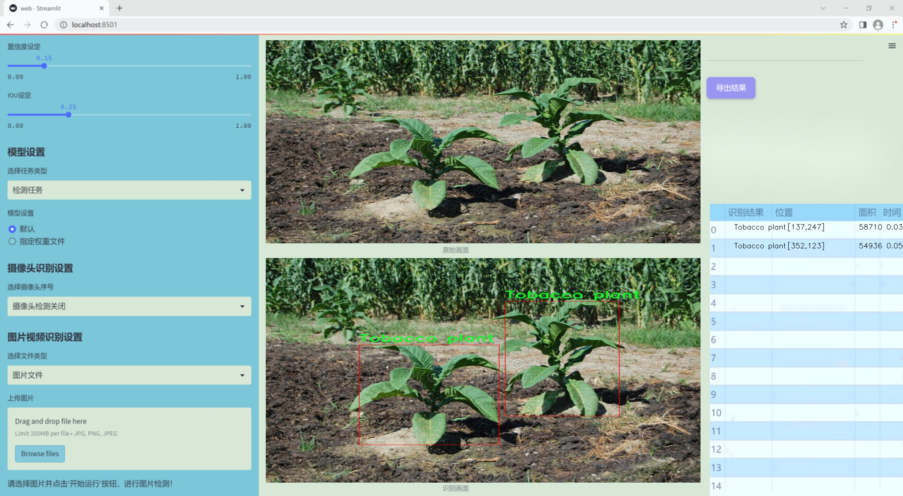
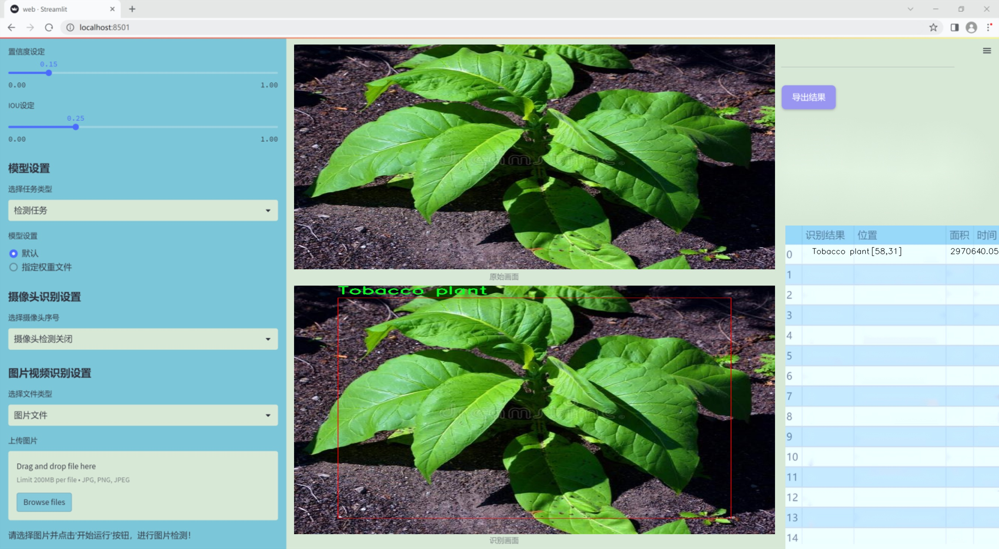
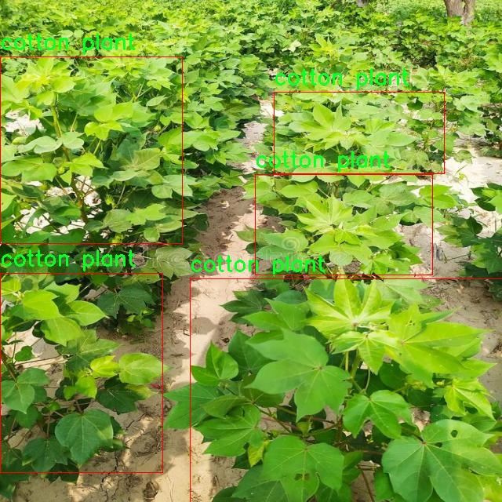
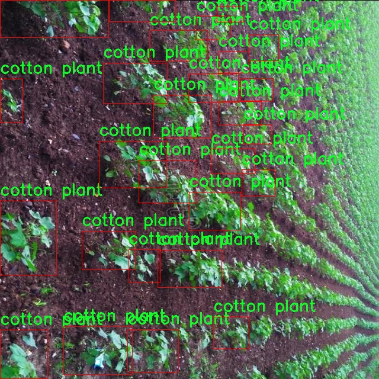
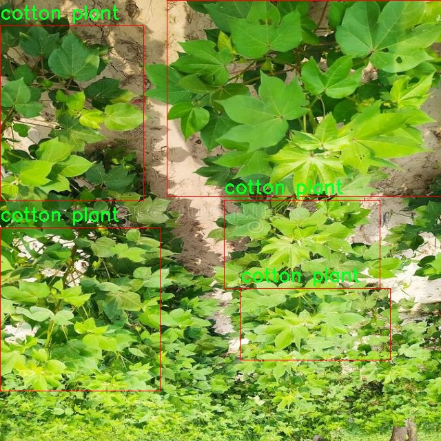
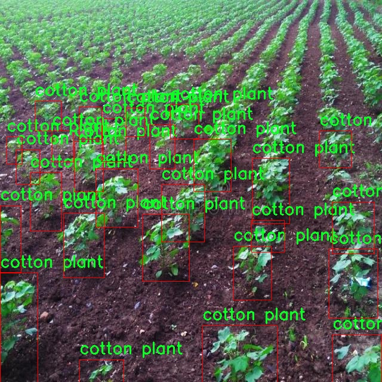
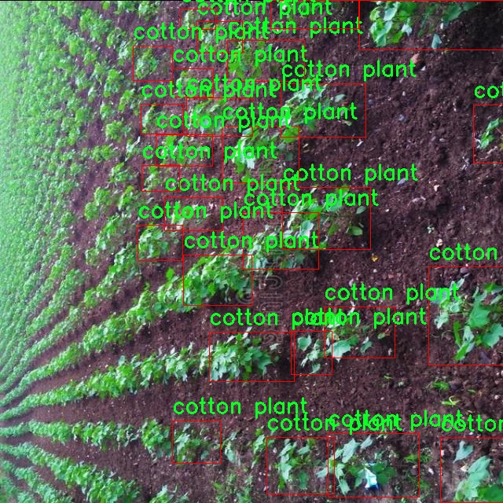

### 1.背景意义

研究背景与意义

随着全球农业生产的不断发展，植物计数与分类技术在精准农业、作物监测和管理中扮演着越来越重要的角色。传统的人工计数方法不仅耗时耗力，而且容易受到人为因素的影响，导致计数结果的不准确性。因此，利用计算机视觉技术进行植物计数与分类，成为提升农业生产效率和管理水平的有效手段。近年来，深度学习特别是目标检测算法的快速发展，为这一领域提供了新的解决方案。

YOLO（You Only Look Once）系列算法因其高效的实时检测能力和良好的准确性，广泛应用于各种目标检测任务。YOLOv11作为该系列的最新版本，进一步提升了检测精度和速度，使其在复杂环境下的应用潜力更为显著。本研究旨在基于改进的YOLOv11算法，构建一个高效的烟叶植株计数与分类系统，专注于烟草植物和棉花植物的识别与计数。通过对包含3150张图像的数据集进行训练，该系统将实现对这两类植物的精准识别，为农业生产提供科学依据。

在数据集的构建过程中，采用了多种数据增强技术，以提高模型的泛化能力和鲁棒性。这些技术包括图像的水平翻转、垂直翻转及90度旋转等，使得模型能够在不同的环境和光照条件下保持良好的性能。此外，数据集的标注采用了YOLOv8格式，便于与现有的深度学习框架兼容，提升了模型训练的效率。

本研究不仅为烟叶植株的监测提供了创新的技术手段，还为其他农作物的智能化管理提供了参考。通过提高植物计数与分类的准确性，能够有效支持农业决策，促进可持续发展，最终实现农业生产的智能化与现代化。

### 2.视频效果

[2.1 视频效果](https://www.bilibili.com/video/BV1QrmyYzE9w/)

### 3.图片效果







##### [项目涉及的源码数据来源链接](https://kdocs.cn/l/cszuIiCKVNis)**

注意：本项目提供训练的数据集和训练教程,由于版本持续更新,暂不提供权重文件（best.pt）,请按照6.训练教程进行训练后实现上图演示的效果。

### 4.数据集信息

##### 4.1 本项目数据集类别数＆类别名

nc: 2
names: ['Tobacco plant', 'cotton plant']


该项目为【目标检测】数据集，请在【训练教程和Web端加载模型教程（第三步）】这一步的时候按照【目标检测】部分的教程来训练

##### 4.2 本项目数据集信息介绍

本项目数据集信息介绍

本项目旨在改进YOLOv11模型，以实现高效的烟叶植株计数与分类系统。为此，我们构建了一个专门的数据集，聚焦于植物计数这一主题。该数据集包含两类植物，分别为“烟草植株”和“棉花植株”，共计两个类别。这些类别的选择不仅反映了农业生产中的重要性，也为模型的训练提供了丰富的多样性和挑战性。

在数据集的构建过程中，我们采集了大量的图像数据，涵盖了不同生长阶段、不同光照条件以及不同背景下的烟草和棉花植株。这种多样性确保了模型在实际应用中的鲁棒性，能够适应各种环境和条件下的植物识别任务。每张图像都经过精确标注，确保模型能够准确学习到每个类别的特征，从而提高计数和分类的准确性。

此外，数据集的设计还考虑到了现实农业场景中的复杂性，例如植株之间的遮挡、不同植株的生长高度差异等。这些因素都可能影响模型的表现，因此我们在数据集中尽量模拟这些情况，以便训练出更为智能和适应性强的YOLOv11模型。通过这种方式，我们希望能够提升烟叶和棉花植株的自动识别能力，为农业生产提供更为高效的技术支持。

总之，本项目的数据集不仅为YOLOv11模型的训练提供了必要的基础数据，也为后续的研究和应用奠定了坚实的基础。通过不断优化和扩展数据集，我们期望能够推动植物计数与分类技术的发展，为现代农业的智能化进程贡献力量。











### 5.全套项目环境部署视频教程（零基础手把手教学）

[5.1 所需软件PyCharm和Anaconda安装教程（第一步）](https://www.bilibili.com/video/BV1BoC1YCEKi/?spm_id_from=333.999.0.0&vd_source=bc9aec86d164b67a7004b996143742dc)


[5.2 安装Python虚拟环境创建和依赖库安装视频教程（第二步）](https://www.bilibili.com/video/BV1ZoC1YCEBw?spm_id_from=333.788.videopod.sections&vd_source=bc9aec86d164b67a7004b996143742dc)

### 6.改进YOLOv11训练教程和Web_UI前端加载模型教程（零基础手把手教学）

[6.1 改进YOLOv11训练教程和Web_UI前端加载模型教程（第三步）](https://www.bilibili.com/video/BV1BoC1YCEhR?spm_id_from=333.788.videopod.sections&vd_source=bc9aec86d164b67a7004b996143742dc)


按照上面的训练视频教程链接加载项目提供的数据集，运行train.py即可开始训练



     Epoch   gpu_mem       box       obj       cls    labels  img_size
     1/200     20.8G   0.01576   0.01955  0.007536        22      1280: 100%|██████████| 849/849 [14:42<00:00,  1.04s/it]
               Class     Images     Labels          P          R     mAP@.5 mAP@.5:.95: 100%|██████████| 213/213 [01:14<00:00,  2.87it/s]
                 all       3395      17314      0.994      0.957      0.0957      0.0843

     Epoch   gpu_mem       box       obj       cls    labels  img_size
     2/200     20.8G   0.01578   0.01923  0.007006        22      1280: 100%|██████████| 849/849 [14:44<00:00,  1.04s/it]
               Class     Images     Labels          P          R     mAP@.5 mAP@.5:.95: 100%|██████████| 213/213 [01:12<00:00,  2.95it/s]
                 all       3395      17314      0.996      0.956      0.0957      0.0845

     Epoch   gpu_mem       box       obj       cls    labels  img_size
     3/200     20.8G   0.01561    0.0191  0.006895        27      1280: 100%|██████████| 849/849 [10:56<00:00,  1.29it/s]
               Class     Images     Labels          P          R     mAP@.5 mAP@.5:.95: 100%|███████   | 187/213 [00:52<00:00,  4.04it/s]
                 all       3395      17314      0.996      0.957      0.0957      0.0845


###### [项目数据集下载链接](https://kdocs.cn/l/cszuIiCKVNis)

### 7.原始YOLOv11算法讲解

YOLO11采用改进的骨干和颈部架构，增强了特征提取能力，提高了物体检测的精确度和复杂任务的表现。YOLO11引入精炼的架构设计和优化的训练流程，实现更快的处理速度，同时保持精度和性能之间的最佳平衡。通过模型设计的进步，YOLO11m在COCO数据集上实现了更高的均值平均精度（mAP），同时使用比YOLOv8m少22%的参数，使其在不妥协准确性的情况下更加计算高效。YOLO11可以无缝部署在各种环境中，包括边缘设备、云平台以及支持NVIDIA
GPU的系统，确保最大灵活性。无论是物体检测、实例分割、图像分类、姿态估计，还是定向物体检测（OBB），YOLO11都旨在应对多样的计算机视觉挑战。


##### **Ultralytics YOLO11相比于之前版本的主要改进有哪些？**

Ultralytics YOLO11在其前身基础上引入了几项重要进步。主要改进包括：

  1. **增强的特征提取** ：YOLO11采用改进的骨干和颈部架构，增强了特征提取能力，提高了物体检测的精确度。
  2.  **优化的效率和速度** ：精炼的架构设计和优化的训练流程实现了更快的处理速度，同时保持了准确性和性能之间的平衡。
  3.  **更高的准确性与更少的参数** ：YOLO11m在COCO数据集上实现了更高的均值平均精度（mAP），同时使用比YOLOv8m少22%的参数，使其在不妥协准确性的情况下更加计算高效。
  4.  **环境适应性强** ：YOLO11可以在多种环境中部署，包括边缘设备、云平台以及支持NVIDIA GPU的系统。
  5.  **支持广泛的任务** ：YOLO11支持多种计算机视觉任务，如物体检测、实例分割、图像分类、姿态估计和定向物体检测（OBB）。

我们先来看一下其网络结构有什么变化，可以看出，相比较于YOLOv8模型，其将CF2模块改成C3K2，同时在SPPF模块后面添加了一个C2PSA模块，且将YOLOv10的head思想引入到YOLO11的head中，使用深度可分离的方法，减少冗余计算，提高效率。下面我们来详细看一下这两个模块的结构是怎么构成的，以及它们为什么要这样设计


##### C3K2的网络结构

从下面图中我们可以看到，C3K2模块其实就是C2F模块转变出来的，它代码中有一个设置，就是当c3k这个参数为FALSE的时候，C3K2模块就是C2F模块，也就是说它的Bottleneck是普通的Bottleneck；反之当它为true的时候，将Bottleneck模块替换成C3模块。


##### C2PSA的网络结构

` `C2PSA是对 `C2f` 模块的扩展，它结合了PSA(Pointwise Spatial
Attention)块，用于增强特征提取和注意力机制。通过在标准 `C2f` 模块中引入 PSA
块，C2PSA实现了更强大的注意力机制，从而提高了模型对重要特征的捕捉能力。


##### **C2f 模块回顾：**

**** C2f模块是一个更快的 CSP（Cross Stage Partial）瓶颈实现，它通过两个卷积层和多个 Bottleneck
块进行特征提取。相比传统的 CSPNet，C2f 优化了瓶颈层的结构，使得计算速度更快。在 C2f中，`cv1` 是第一个 1x1
卷积，用于减少通道数；`cv2` 是另一个 1x1 卷积，用于恢复输出通道数。而 `n` 是一个包含 Bottleneck 块的数量，用于提取特征。

##### **C2PSA 模块的增强** ：

**C2PSA** 扩展了 C2f，通过引入PSA( **Position-Sensitive Attention)**
，旨在通过多头注意力机制和前馈神经网络来增强特征提取能力。它可以选择性地添加残差结构（shortcut）以优化梯度传播和网络训练效果。同时，使用FFN
可以将输入特征映射到更高维的空间，捕获输入特征的复杂非线性关系，允许模型学习更丰富的特征表示。

##### head部分

YOLO11在head部分的cls分支上使用深度可分离卷积 ，具体代码如下，cv2边界框回归分支，cv3分类分支。

    
    
     self.cv2 = nn.ModuleList(
                nn.Sequential(Conv(x, c2, 3), Conv(c2, c2, 3), nn.Conv2d(c2, 4 * self.reg_max, 1)) for x in ch
            )
            self.cv3 = nn.ModuleList(
                nn.Sequential(
                    nn.Sequential(DWConv(x, x, 3), Conv(x, c3, 1)),
                    nn.Sequential(DWConv(c3, c3, 3), Conv(c3, c3, 1)),
                    nn.Conv2d(c3, self.nc, 1),
                )
                for x in ch
            )


### 8.200+种全套改进YOLOV11创新点原理讲解

#### 8.1 200+种全套改进YOLOV11创新点原理讲解大全

由于篇幅限制，每个创新点的具体原理讲解就不全部展开，具体见下列网址中的改进模块对应项目的技术原理博客网址【Blog】（创新点均为模块化搭建，原理适配YOLOv5~YOLOv11等各种版本）

[改进模块技术原理博客【Blog】网址链接](https://gitee.com/qunmasj/good)


#### 8.2 精选部分改进YOLOV11创新点原理讲解

###### 这里节选部分改进创新点展开原理讲解(完整的改进原理见上图和[改进模块技术原理博客链接](https://gitee.com/qunmasj/good)【如果此小节的图加载失败可以通过CSDN或者Github搜索该博客的标题访问原始博客，原始博客图片显示正常】
### 可变性卷积DCN简介
卷积神经网络由于其构建模块中固定的几何结构，本质上受限于模型几何变换。为了提高卷积神经网络的转换建模能力，《Deformable Convolutional Networks》作者提出了两个模块：可变形卷积（deformable convolution）和可变形RoI池（deformable RoI pooling）。这两个模块均基于用额外的偏移来增加模块中的空间采样位置以及从目标任务中学习偏移的思想，而不需要额外的监督。

第一次证明了在深度神经网络中学习密集空间变换（dense spatial transformation）对于复杂的视觉任务是有效的

视觉识别中的一个关键挑战是如何适应对象比例、姿态、视点和零件变形中的几何变化或模型几何变换。一般有两种方法实现：
1）建立具有足够期望变化的训练数据集。这通常通过增加现有的数据样本来实现，例如通过仿射变换。但是训练成本昂贵而且模型参数庞大。
2）使用变换不变（transformation-invariant）的特征和算法。比如比较有名的SIFT(尺度不变特征变换)便是这一类的代表算法。

但以上的方法有两个缺点：
1）几何变换被假定为固定的和已知的，这些先验知识被用来扩充数据，设计特征和算法。为此，这个假设阻止了对具有未知几何变换的新任务的推广，从而导致这些几何变换可能没有被正确建模。
2）对于不变特征和算法进行手动设计，对于过于复杂的变换可能是困难的或不可行的。

卷积神经网络本质上局限于模拟大型未知转换。局限性源于CNN模块的固定几何结构：卷积单元在固定位置对输入特征图进行采样；池化层以固定比率降低特征矩阵分辨率；RoI（感兴趣区域）池化层将RoI分成固定的空间箱（spatial bins）等。缺乏处理几何变换的内部机制。

这种内部机制的缺乏会导致一些问题，举个例子。同一个CNN层中所有激活单元的感受野大小是相同的，但是这是不可取的。因为不同的位置可能对应于具有不同尺度或变形的对象，所以尺度或感受野大小的自适应确定对于具有精细定位的视觉识别是渴望的。

对于这些问题，作者提出了两个模块提高CNNs对几何变换建模的能力。


deformable convolution（可变形卷积）
将2D偏移量添加到标准卷积中的常规网格采样位置，使得采样网格能够自由变形。通过额外的卷积层，从前面的特征映射中学习偏移。因此，变形采用局部、密集和自适应的方式取决于输入特征。


deformable RoI pooling（可变形RoI池化）
为先前RoI池化的常规库（bin）分区中的每个库位置（bin partition）增加了一个偏移量。类似地，偏移是从前面的特征图和感兴趣区域中学习的，从而能够对具有不同形状的对象进行自适应部件定位（adaptive part localization）。

#### Deformable Convolutional Networks
Deformable Convolution
2D卷积由两个步骤组成：
1）在输入特征图x xx上使用规则网格R RR进行采样。
2）把这些采样点乘不同权重w ww后相加。

网格R定义感受野大小和扩张程度，比如内核大小为3x3，扩张程度为1的网格R可以表示为：
R = { ( − 1 , − 1 ) , ( − 1 , 0 ) , … , ( 0 , 1 ) , ( 1 , 1 ) } R = \{(-1,-1),(-1,0),\dots,(0,1),(1,1)\}
R={(−1,−1),(−1,0),…,(0,1),(1,1)}

​
 一般为小数，使用双线性插值进行处理。（把小数坐标分解到相邻的四个整数坐标点来计算结果）


具体操作如图所示：


首先对输入特征层进行一个普通的3x3卷积处理得到偏移域（offset field）。偏移域特征图具有与输入特征图相同的空间分辨率，channels维度2N对应于N个2D（xy两个方向）偏移。其中的N是原输入特征图上所具有的N个channels，也就是输入输出channels保持不变，这里xy两个channels分别对输出特征图上的一个channels进行偏移。确定采样点后就通过与相对应的权重w点乘相加得到输出特征图上该点最终值。

前面也提到过，由于这里xy两个方向所训练出来的偏移量一般来说是一个小数，那么为了得到这个点所对应的数值，会采用双线性插值的方法，从最近的四个邻近坐标点中计算得到该偏移点的数值，公式如下：


具体推理过程见：双线性插值原理

#### Deformable RoI Poolingb
所有基于区域提议（RPN）的对象检测方法都使用RoI池话处理，将任意大小的输入矩形区域转换为固定大小的特征图。


 一般为小数，需要使用双线性插值进行处理。


具体操作如图所示：


当时看这个部分的时候觉得有些突兀，明明RoI池化会将特征层转化为固定尺寸的区域。其实，我个人觉得，这个部分与上述的可变性卷积操作是类似的。这里同样是使用了一个普通的RoI池化操作，进行一些列处理后得到了一个偏移域特征图，然后重新作用于原来的w × H w \times Hw×H的RoI。只不过这里不再是规律的逐行逐列对每个格子进行池化，而是对于格子进行偏移后再池化处理。

#### Postion﹣Sensitive RoI Pooling
除此之外，论文还提出一种PS RoI池化（Postion﹣Sensitive RoI Pooling）。不同于上述可变形RoI池化中的全连接过程，这里使用全卷积替换。

具体操作如图所示：


首先，对于原来的特征图来说，原本是将输入特征图上的RoI区域分成k × k k\times kk×k个bin。而在这里，则是将输入特征图进行卷积操作，分别得到一个channels为k 2 ( C + 1 ) k^{2}(C+1)k (C+1)的得分图（score maps）和一个channels为2 k 2 ( C + 1 ) 2k{2}(C+1)2k 2 (C+1)的偏移域（offset fields），这两个特征矩阵的宽高是与输入特征矩阵相同的。其中，得分图的channels中，k × k k \times kk×k分别表示的是每一个网格，C CC表示的检测对象的类别数目，1表示背景。而在偏移域中的2表示xy两个方向的偏移。
也就是说，在PS RoI池化中，对于RoI的每一个网格都独自占一个通道形成一层得分图，然后其对于的偏移量占两个通道。offset fields得到的偏移是归一化后的偏移，需要通过和deformable RoI pooling中一样的变换方式得到∆ p i j ∆p_{ij}∆p ij，然后对每层得分图进行偏移池化处理。最后处理完的结果就对应着最后输出的一个网格。所以其包含了位置信息。

原文论述为：


#### Understanding Deformable ConvNets
当可变形卷积叠加时，复合变形的效果是深远的。如图所示：


ps：a是标准卷积的固定感受野，b是可变形卷积的适应性感受野。

感受野和标准卷积中的采样位置在整个顶部特征图上是固定的(左)。在可变形卷积中，它们根据对象的比例和形状进行自适应调整(右)。


### 9.系统功能展示

图9.1.系统支持检测结果表格显示

  图9.2.系统支持置信度和IOU阈值手动调节

  图9.3.系统支持自定义加载权重文件best.pt(需要你通过步骤5中训练获得)

  图9.4.系统支持摄像头实时识别

  图9.5.系统支持图片识别

  图9.6.系统支持视频识别

  图9.7.系统支持识别结果文件自动保存

  图9.8.系统支持Excel导出检测结果数据


### 10. YOLOv11核心改进源码讲解

#### 10.1 test_selective_scan_easy.py


这个文件 `test_selective_scan_easy.py` 主要是实现了一种选择性扫描（Selective Scan）算法的测试与实现，使用了 PyTorch 框架。该算法主要用于处理序列数据，常见于深度学习中的序列建模任务。文件中包含了多个函数和类，下面是对代码的逐步分析和说明。

首先，文件中导入了一些必要的库，包括 `math`、`torch`、`torch.nn.functional`、`pytest` 和 `einops`。这些库提供了数学运算、张量操作、测试框架等功能。

接下来，定义了一个名为 `selective_scan_easy` 的函数，它实现了选择性扫描的核心逻辑。函数的输入包括多个张量，分别表示输入序列、时间差、矩阵 A、B、C、D 以及一些可选参数（如偏置、softplus 标志、返回最后状态的标志和块大小）。函数内部定义了一个嵌套函数 `selective_scan_chunk`，用于处理输入的块。

在 `selective_scan_chunk` 函数中，使用了张量运算来实现选择性扫描的逻辑。主要的计算包括：
- 计算时间的累积和。
- 计算矩阵 A 的指数。
- 根据输入序列和时间差计算中间状态和输出。

函数的最后返回计算得到的输出和状态。

`selective_scan_easy` 函数还处理了一些输入的预处理，包括数据类型转换、形状调整等。然后，它通过循环将输入数据分块处理，并将每个块的输出拼接在一起，最终返回完整的输出。

接下来，定义了一个 `SelectiveScanEasy` 类，继承自 `torch.autograd.Function`，用于实现自定义的前向和反向传播逻辑。这个类的 `forward` 方法调用了之前定义的 `selective_scan_easy` 函数，并保存必要的张量以便后续的反向传播使用。`backward` 方法则实现了反向传播的计算，计算各个输入的梯度。

此外，文件中还定义了多个版本的选择性扫描函数（如 `selective_scan_easyv2` 和 `selective_scan_easyv3`），这些版本可能在实现细节上有所不同，目的是优化性能或支持不同的输入格式。

文件的最后部分是测试代码，使用 `pytest` 框架定义了一个名为 `test_selective_scan` 的测试函数。该函数通过多种参数组合测试选择性扫描的实现，确保其输出与参考实现一致。测试中会检查输出的最大差异和均值差异，并进行梯度的验证。

总的来说，这个文件实现了选择性扫描算法的核心逻辑，并通过测试确保其正确性。该算法在处理序列数据时具有高效性和灵活性，适用于多种深度学习任务。

#### 10.1 mamba_yolo.py

以下是代码中最核心的部分，并附上详细的中文注释：

```python
import torch
import torch.nn as nn
from einops import rearrange

class LayerNorm2d(nn.Module):
    """二维层归一化"""
    def __init__(self, normalized_shape, eps=1e-6, elementwise_affine=True):
        super().__init__()
        self.norm = nn.LayerNorm(normalized_shape, eps, elementwise_affine)

    def forward(self, x):
        # 将输入的形状从 (B, C, H, W) 转换为 (B, H, W, C)
        x = rearrange(x, 'b c h w -> b h w c').contiguous()
        # 应用层归一化
        x = self.norm(x)
        # 将形状转换回 (B, C, H, W)
        x = rearrange(x, 'b h w c -> b c h w').contiguous()
        return x

class CrossScan(torch.autograd.Function):
    """交叉扫描操作"""
    @staticmethod
    def forward(ctx, x: torch.Tensor):
        B, C, H, W = x.shape
        ctx.shape = (B, C, H, W)
        xs = x.new_empty((B, 4, C, H * W))
        # 将输入张量展平并进行转置以生成交叉扫描的四个视图
        xs[:, 0] = x.flatten(2, 3)  # 原始视图
        xs[:, 1] = x.transpose(dim0=2, dim1=3).flatten(2, 3)  # 转置视图
        xs[:, 2:4] = torch.flip(xs[:, 0:2], dims=[-1])  # 翻转视图
        return xs

    @staticmethod
    def backward(ctx, ys: torch.Tensor):
        B, C, H, W = ctx.shape
        L = H * W
        # 反向传播计算
        ys = ys[:, 0:2] + ys[:, 2:4].flip(dims=[-1]).view(B, 2, -1, L)
        y = ys[:, 0] + ys[:, 1].view(B, -1, W, H).transpose(dim0=2, dim1=3).contiguous().view(B, -1, L)
        return y.view(B, -1, H, W)

class SelectiveScanCore(torch.autograd.Function):
    """选择性扫描核心操作"""
    @staticmethod
    @torch.cuda.amp.custom_fwd
    def forward(ctx, u, delta, A, B, C, D=None, delta_bias=None, delta_softplus=False, nrows=1, backnrows=1, oflex=True):
        # 确保输入张量是连续的
        if u.stride(-1) != 1:
            u = u.contiguous()
        if delta.stride(-1) != 1:
            delta = delta.contiguous()
        if D is not None and D.stride(-1) != 1:
            D = D.contiguous()
        if B.stride(-1) != 1:
            B = B.contiguous()
        if C.stride(-1) != 1:
            C = C.contiguous()
        
        # 如果 B 或 C 的维度是 3，则在第一个维度上增加一个维度
        if B.dim() == 3:
            B = B.unsqueeze(dim=1)
            ctx.squeeze_B = True
        if C.dim() == 3:
            C = C.unsqueeze(dim=1)
            ctx.squeeze_C = True
        
        ctx.delta_softplus = delta_softplus
        ctx.backnrows = backnrows
        
        # 调用 CUDA 核心进行前向计算
        out, x, *rest = selective_scan_cuda_core.fwd(u, delta, A, B, C, D, delta_bias, delta_softplus, 1)
        ctx.save_for_backward(u, delta, A, B, C, D, delta_bias, x)
        return out

    @staticmethod
    @torch.cuda.amp.custom_bwd
    def backward(ctx, dout, *args):
        u, delta, A, B, C, D, delta_bias, x = ctx.saved_tensors
        if dout.stride(-1) != 1:
            dout = dout.contiguous()
        # 调用 CUDA 核心进行反向计算
        du, ddelta, dA, dB, dC, dD, ddelta_bias, *rest = selective_scan_cuda_core.bwd(
            u, delta, A, B, C, D, delta_bias, dout, x, ctx.delta_softplus, 1
        )
        return (du, ddelta, dA, dB, dC, dD, ddelta_bias, None, None, None, None)

def cross_selective_scan(x: torch.Tensor, x_proj_weight: torch.Tensor, dt_projs_weight: torch.Tensor, A_logs: torch.Tensor, Ds: torch.Tensor, out_norm: torch.nn.Module = None):
    """交叉选择性扫描的实现"""
    B, D, H, W = x.shape
    D, N = A_logs.shape
    K, D, R = dt_projs_weight.shape
    L = H * W

    # 进行交叉扫描
    xs = CrossScan.apply(x)

    # 计算双重投影
    x_dbl = torch.einsum("b k d l, k c d -> b k c l", xs, x_proj_weight)
    dts, Bs, Cs = torch.split(x_dbl, [R, N, N], dim=2)
    dts = torch.einsum("b k r l, k d r -> b k d l", dts, dt_projs_weight)
    
    # HiPPO 矩阵
    As = -torch.exp(A_logs.to(torch.float))  # (k * c, d_state)
    Bs = Bs.contiguous()
    Cs = Cs.contiguous()
    Ds = Ds.to(torch.float)  # (K * c)

    # 选择性扫描
    ys: torch.Tensor = SelectiveScanCore.apply(xs, dts, As, Bs, Cs, Ds)

    # 进行归一化处理
    if out_norm is not None:
        y = out_norm(ys.view(B, -1, H, W)).permute(0, 2, 3, 1)  # (B, H, W, C)
    else:
        y = ys.transpose(dim0=1, dim1=2).contiguous()  # (B, L, C)

    return y

class SS2D(nn.Module):
    """选择性扫描 2D 模块"""
    def __init__(self, d_model=96, d_state=16, ssm_ratio=2.0, ssm_rank_ratio=2.0, dt_rank="auto", act_layer=nn.SiLU, dropout=0.0):
        super().__init__()
        self.d_model = d_model
        self.d_state = d_state
        self.ssm_ratio = ssm_ratio
        self.ssm_rank_ratio = ssm_rank_ratio
        self.dt_rank = dt_rank

        # 输入投影
        self.in_proj = nn.Conv2d(d_model, int(ssm_ratio * d_model), kernel_size=1, stride=1, bias=False)
        self.act = act_layer()
        self.out_proj = nn.Conv2d(int(ssm_ratio * d_model), d_model, kernel_size=1, stride=1, bias=False)
        self.dropout = nn.Dropout(dropout)

    def forward(self, x: torch.Tensor):
        x = self.in_proj(x)  # 输入投影
        x = self.act(x)  # 激活函数
        x = self.dropout(x)  # Dropout
        x = self.out_proj(x)  # 输出投影
        return x

class VSSBlock_YOLO(nn.Module):
    """YOLO 的 VSS 块"""
    def __init__(self, in_channels: int, hidden_dim: int, drop_path: float = 0):
        super().__init__()
        self.proj_conv = nn.Conv2d(in_channels, hidden_dim, kernel_size=1, stride=1, padding=0, bias=True)
        self.ss2d = SS2D(d_model=hidden_dim)  # 选择性扫描模块
        self.drop_path = nn.Dropout(drop_path)

    def forward(self, input: torch.Tensor):
        input = self.proj_conv(input)  # 投影
        x = self.ss2d(input)  # 选择性扫描
        x = input + self.drop_path(x)  # 残差连接
        return x
```

### 代码核心部分说明：
1. **LayerNorm2d**: 实现了二维层归一化，用于对图像数据进行归一化处理。
2. **CrossScan**: 定义了交叉扫描操作，能够生成四个不同的视图以便于后续处理。
3. **SelectiveScanCore**: 实现了选择性扫描的前向和反向传播逻辑，核心功能是对输入进行选择性扫描以提取特征。
4. **cross_selective_scan**: 封装了交叉选择性扫描的逻辑，计算输入的双重投影并进行选择性扫描。
5. **SS2D**: 实现了选择性扫描的 2D 模块，包含输入投影、激活函数和输出投影。
6. **VSSBlock_YOLO**: YOLO 模型中的 VSS 块，结合了投影、选择性扫描和残差连接。

这些部分是整个模型的核心，负责特征提取和处理。

这个程序文件 `mamba_yolo.py` 是一个用于实现 YOLO（You Only Look Once）目标检测模型的 PyTorch 代码。文件中包含了多个自定义的神经网络模块和函数，主要用于构建和训练深度学习模型。以下是对代码的详细说明：

首先，代码导入了一些必要的库，包括 `torch`、`math`、`functools` 和 `torch.nn` 等。`einops` 库用于张量的重排，`timm.layers` 提供了一些层的实现。文件中还尝试导入一些 CUDA 相关的模块，用于加速计算。

接下来，定义了一个 `LayerNorm2d` 类，它是一个二维的层归一化模块。该模块在前向传播中会对输入张量进行形状重排，以适应 `LayerNorm` 的要求。

`autopad` 函数用于自动计算卷积层的填充，以确保输出形状与输入形状相同。

接着，定义了 `CrossScan` 和 `CrossMerge` 类，这两个类实现了交叉扫描和交叉合并的功能。它们的前向和反向传播方法利用了 PyTorch 的自定义函数机制，能够高效地处理张量。

`SelectiveScanCore` 类实现了选择性扫描的核心功能。它的前向和反向传播方法调用了 CUDA 加速的函数，以提高计算效率。

`cross_selective_scan` 函数则是一个封装函数，整合了选择性扫描的过程，处理输入张量并进行一系列的线性变换和归一化操作。

`SS2D` 类是一个重要的模块，包含了多种参数和超参数的初始化。它实现了一个深度学习的基本结构，结合了选择性扫描和其他卷积操作。

`RGBlock` 和 `LSBlock` 类分别实现了残差块和线性块，主要用于特征提取和处理。它们通过卷积层和激活函数来增强模型的表达能力。

`XSSBlock` 和 `VSSBlock_YOLO` 类则是 YOLO 模型的核心模块，结合了选择性扫描和其他结构，构建了复杂的特征提取网络。

`SimpleStem` 类是一个简单的卷积网络，用于输入数据的初步处理，通常作为模型的输入层。

最后，`VisionClueMerge` 类实现了特征的合并操作，主要用于在不同尺度上融合特征图，以增强模型的检测能力。

整体来看，这个文件实现了一个复杂的深度学习模型结构，主要用于目标检测任务，利用了多种先进的技术和模块，以提高模型的性能和效率。

#### 10.2 kagn_conv.py

以下是代码中最核心的部分，并附上详细的中文注释：

```python
import torch
import torch.nn as nn
from functools import lru_cache

class KAGNConvNDLayer(nn.Module):
    def __init__(self, conv_class, norm_class, conv_w_fun, input_dim, output_dim, degree, kernel_size,
                 groups=1, padding=0, stride=1, dilation=1, dropout: float = 0.0, ndim: int = 2):
        super(KAGNConvNDLayer, self).__init__()
        
        # 初始化参数
        self.inputdim = input_dim  # 输入维度
        self.outdim = output_dim    # 输出维度
        self.degree = degree         # 多项式的度数
        self.kernel_size = kernel_size  # 卷积核大小
        self.padding = padding       # 填充
        self.stride = stride         # 步幅
        self.dilation = dilation     # 膨胀
        self.groups = groups         # 分组卷积的组数
        self.base_activation = nn.SiLU()  # 基础激活函数
        self.conv_w_fun = conv_w_fun  # 卷积权重函数
        self.ndim = ndim             # 数据的维度（1D, 2D, 3D）
        self.dropout = None          # Dropout层

        # 根据维度选择合适的Dropout层
        if dropout > 0:
            if ndim == 1:
                self.dropout = nn.Dropout1d(p=dropout)
            elif ndim == 2:
                self.dropout = nn.Dropout2d(p=dropout)
            elif ndim == 3:
                self.dropout = nn.Dropout3d(p=dropout)

        # 检查参数的有效性
        if groups <= 0:
            raise ValueError('groups must be a positive integer')
        if input_dim % groups != 0:
            raise ValueError('input_dim must be divisible by groups')
        if output_dim % groups != 0:
            raise ValueError('output_dim must be divisible by groups')

        # 创建基础卷积层和归一化层
        self.base_conv = nn.ModuleList([conv_class(input_dim // groups,
                                                   output_dim // groups,
                                                   kernel_size,
                                                   stride,
                                                   padding,
                                                   dilation,
                                                   groups=1,
                                                   bias=False) for _ in range(groups)])

        self.layer_norm = nn.ModuleList([norm_class(output_dim // groups) for _ in range(groups)])

        # 多项式权重的形状
        poly_shape = (groups, output_dim // groups, (input_dim // groups) * (degree + 1)) + tuple(
            kernel_size for _ in range(ndim))

        # 初始化多项式权重和beta权重
        self.poly_weights = nn.Parameter(torch.randn(*poly_shape))
        self.beta_weights = nn.Parameter(torch.zeros(degree + 1, dtype=torch.float32))

        # 使用Kaiming均匀分布初始化卷积层权重
        for conv_layer in self.base_conv:
            nn.init.kaiming_uniform_(conv_layer.weight, nonlinearity='linear')

        nn.init.kaiming_uniform_(self.poly_weights, nonlinearity='linear')
        nn.init.normal_(
            self.beta_weights,
            mean=0.0,
            std=1.0 / ((kernel_size ** ndim) * self.inputdim * (self.degree + 1.0)),
        )

    def beta(self, n, m):
        # 计算beta值，用于Legendre多项式的计算
        return (
            ((m + n) * (m - n) * n ** 2) / (m ** 2 / (4.0 * n ** 2 - 1.0))
        ) * self.beta_weights[n]

    @lru_cache(maxsize=128)  # 使用缓存避免重复计算Legendre多项式
    def gram_poly(self, x, degree):
        # 计算Legendre多项式
        p0 = x.new_ones(x.size())  # P0 = 1

        if degree == 0:
            return p0.unsqueeze(-1)

        p1 = x  # P1 = x
        grams_basis = [p0, p1]

        for i in range(2, degree + 1):
            p2 = x * p1 - self.beta(i - 1, i) * p0  # 递归计算
            grams_basis.append(p2)
            p0, p1 = p1, p2

        return torch.cat(grams_basis, dim=1)  # 将多项式基组合在一起

    def forward_kag(self, x, group_index):
        # 前向传播函数，处理每个组的输入
        basis = self.base_conv[group_index](self.base_activation(x))  # 基础卷积

        # 将输入归一化到[-1, 1]范围内
        x = torch.tanh(x).contiguous()

        if self.dropout is not None:
            x = self.dropout(x)  # 应用Dropout

        grams_basis = self.base_activation(self.gram_poly(x, self.degree))  # 计算Gram多项式基

        # 使用卷积权重函数计算输出
        y = self.conv_w_fun(grams_basis, self.poly_weights[group_index],
                            stride=self.stride, dilation=self.dilation,
                            padding=self.padding, groups=1)

        # 归一化并激活输出
        y = self.base_activation(self.layer_norm[group_index](y + basis))

        return y

    def forward(self, x):
        # 前向传播，处理整个输入
        split_x = torch.split(x, self.inputdim // self.groups, dim=1)  # 按组分割输入
        output = []
        for group_ind, _x in enumerate(split_x):
            y = self.forward_kag(_x.clone(), group_ind)  # 处理每个组
            output.append(y.clone())
        y = torch.cat(output, dim=1)  # 合并输出
        return y
```

### 代码说明：
1. **KAGNConvNDLayer类**：这是一个自定义的卷积层，支持任意维度的卷积（1D、2D、3D），并结合了Legendre多项式的计算。
2. **初始化方法**：设置输入输出维度、卷积参数、激活函数等，并初始化卷积层和归一化层。
3. **beta方法**：计算用于Legendre多项式的beta值。
4. **gram_poly方法**：计算给定度数的Legendre多项式，并使用缓存以提高效率。
5. **forward_kag方法**：实现了每个组的前向传播，计算卷积和激活。
6. **forward方法**：处理整个输入，按组分割并合并输出。

这个代码实现了一个复杂的卷积层，能够在多个维度上进行卷积操作，并结合了多项式的计算以增强模型的表达能力。

这个程序文件 `kagn_conv.py` 定义了一系列用于深度学习的卷积层，主要是基于 KAGN（Kochawongwat et al.）方法。文件中包含一个基类 `KAGNConvNDLayer` 和三个子类 `KAGNConv3DLayer`、`KAGNConv2DLayer` 和 `KAGNConv1DLayer`，分别用于处理三维、二维和一维的卷积操作。

首先，`KAGNConvNDLayer` 类是一个通用的卷积层实现，它接受多个参数，包括输入和输出维度、卷积核大小、分组数、填充、步幅、扩张率、丢弃率等。构造函数中，首先进行了一些参数的验证，确保分组数是正整数，并且输入和输出维度可以被分组数整除。接着，基于传入的卷积类和归一化类，创建了多个卷积层和归一化层的模块列表。

该类还定义了多项式权重和 beta 权重，并使用 Kaiming 均匀分布初始化这些权重，以便于训练的开始。`beta` 方法用于计算与 Legendre 多项式相关的 beta 值，而 `gram_poly` 方法则用于计算 Legendre 多项式的基函数，并使用 LRU 缓存来避免重复计算。

在 `forward_kag` 方法中，首先对输入进行激活，然后通过基础卷积层进行线性变换。接着，输入被归一化到 [-1, 1] 的范围，以便进行稳定的 Legendre 多项式计算。然后，计算多项式基函数，并通过自定义的卷积权重函数进行卷积操作，最后进行归一化和激活处理。

`forward` 方法则将输入分割成多个组，分别通过 `forward_kag` 方法处理每个组，并将结果拼接在一起。

接下来的三个子类分别实现了三维、二维和一维的卷积层。它们通过调用基类的构造函数，传入相应的卷积类和归一化类，简化了多维卷积层的实现。

整体而言，这个文件实现了一个灵活且功能强大的卷积层，能够处理不同维度的数据，并结合了多项式特征和归一化技术，以提高模型的表达能力和训练效果。

#### 10.3 conv.py

以下是经过简化和注释的核心代码部分，主要保留了卷积模块的实现以及相关的注意力机制模块。

```python
import math
import torch
import torch.nn as nn

def autopad(k, p=None, d=1):
    """自动计算填充以保持输出形状与输入相同。"""
    if d > 1:
        k = d * (k - 1) + 1 if isinstance(k, int) else [d * (x - 1) + 1 for x in k]  # 实际的卷积核大小
    if p is None:
        p = k // 2 if isinstance(k, int) else [x // 2 for x in k]  # 自动填充
    return p

class Conv(nn.Module):
    """标准卷积层，包含卷积、批归一化和激活函数。"""

    default_act = nn.SiLU()  # 默认激活函数

    def __init__(self, c1, c2, k=1, s=1, p=None, g=1, d=1, act=True):
        """初始化卷积层，设置输入输出通道、卷积核大小、步幅、填充等参数。"""
        super().__init__()
        self.conv = nn.Conv2d(c1, c2, k, s, autopad(k, p, d), groups=g, dilation=d, bias=False)  # 卷积层
        self.bn = nn.BatchNorm2d(c2)  # 批归一化层
        self.act = self.default_act if act is True else act if isinstance(act, nn.Module) else nn.Identity()  # 激活函数

    def forward(self, x):
        """前向传播：执行卷积、批归一化和激活函数。"""
        return self.act(self.bn(self.conv(x)))

class ChannelAttention(nn.Module):
    """通道注意力模块。"""

    def __init__(self, channels: int) -> None:
        """初始化通道注意力模块，设置基本配置。"""
        super().__init__()
        self.pool = nn.AdaptiveAvgPool2d(1)  # 自适应平均池化
        self.fc = nn.Conv2d(channels, channels, 1, 1, 0, bias=True)  # 1x1卷积
        self.act = nn.Sigmoid()  # Sigmoid激活函数

    def forward(self, x: torch.Tensor) -> torch.Tensor:
        """前向传播：通过卷积和激活函数对输入进行处理。"""
        return x * self.act(self.fc(self.pool(x)))  # 输入与注意力权重相乘

class SpatialAttention(nn.Module):
    """空间注意力模块。"""

    def __init__(self, kernel_size=7):
        """初始化空间注意力模块，设置卷积核大小。"""
        super().__init__()
        assert kernel_size in {3, 7}, "kernel size must be 3 or 7"  # 限制卷积核大小
        padding = 3 if kernel_size == 7 else 1
        self.cv1 = nn.Conv2d(2, 1, kernel_size, padding=padding, bias=False)  # 卷积层
        self.act = nn.Sigmoid()  # Sigmoid激活函数

    def forward(self, x):
        """前向传播：对输入进行空间注意力处理。"""
        return x * self.act(self.cv1(torch.cat([torch.mean(x, 1, keepdim=True), torch.max(x, 1, keepdim=True)[0]], 1)))  # 输入与注意力权重相乘

class CBAM(nn.Module):
    """卷积块注意力模块。"""

    def __init__(self, c1, kernel_size=7):
        """初始化CBAM模块，设置输入通道和卷积核大小。"""
        super().__init__()
        self.channel_attention = ChannelAttention(c1)  # 通道注意力
        self.spatial_attention = SpatialAttention(kernel_size)  # 空间注意力

    def forward(self, x):
        """前向传播：依次通过通道注意力和空间注意力。"""
        return self.spatial_attention(self.channel_attention(x))  # 先计算通道注意力，再计算空间注意力
```

### 代码注释说明
1. **autopad**: 该函数用于自动计算卷积层的填充，以确保输出的形状与输入相同。
2. **Conv**: 这是一个标准的卷积层实现，包含卷积操作、批归一化和激活函数。`forward`方法实现了数据的前向传播。
3. **ChannelAttention**: 该模块实现了通道注意力机制，通过自适应平均池化和1x1卷积来计算通道权重，并与输入相乘以增强特征。
4. **SpatialAttention**: 该模块实现了空间注意力机制，通过对输入的均值和最大值进行卷积操作来计算空间权重，并与输入相乘。
5. **CBAM**: 该模块结合了通道注意力和空间注意力，依次对输入特征进行处理。

这个程序文件 `conv.py` 定义了一系列用于卷积操作的模块，主要用于深度学习中的卷积神经网络（CNN）。文件中包含多个类和函数，每个类实现了不同类型的卷积操作或相关功能。

首先，文件导入了必要的库，包括 `math`、`numpy` 和 `torch`，以及 `torch.nn`，后者是 PyTorch 中用于构建神经网络的模块。`__all__` 变量定义了该模块公开的接口，列出了所有可以被外部导入的类。

接下来，定义了一个辅助函数 `autopad`，用于自动计算卷积操作所需的填充量，以确保输出的形状与输入的形状相同。这个函数根据卷积核的大小、填充和扩张因子来计算填充量。

`Conv` 类实现了标准的卷积层，包含卷积操作、批归一化和激活函数。构造函数中可以设置输入通道数、输出通道数、卷积核大小、步幅、填充、分组和扩张等参数。`forward` 方法执行前向传播，依次应用卷积、批归一化和激活函数。

`Conv2` 类是 `Conv` 类的简化版本，添加了一个 1x1 的卷积层，以实现更复杂的卷积操作。它重写了 `forward` 方法，将两个卷积的输出相加后再通过激活函数。

`LightConv` 类实现了一种轻量级卷积，使用了深度卷积和标准卷积的组合。`DWConv` 类则实现了深度卷积，适用于处理高维数据。

`DSConv` 类实现了深度可分离卷积，它将深度卷积和逐点卷积结合在一起，以减少计算量。

`DWConvTranspose2d` 类实现了深度转置卷积，而 `ConvTranspose` 类则实现了转置卷积层，支持批归一化和激活函数。

`Focus` 类用于将空间信息聚焦到通道维度，通过对输入张量进行特定的拼接操作来实现。

`GhostConv` 类实现了 Ghost 卷积，结合了主要和廉价的操作，以提高特征学习的效率。

`RepConv` 类实现了一种重复卷积模块，支持训练和推理阶段的不同操作，能够在推理时将多个卷积层融合为一个。

`ChannelAttention` 和 `SpatialAttention` 类分别实现了通道注意力和空间注意力机制，能够增强网络对重要特征的关注。

`CBAM` 类则结合了通道注意力和空间注意力，形成了一个完整的卷积块注意力模块。

最后，`Concat` 类用于在指定维度上连接多个张量，方便在网络中处理多通道数据。

总体来说，这个文件实现了一系列高效的卷积模块和注意力机制，适用于构建现代卷积神经网络，尤其是在目标检测和图像处理等任务中。

### 11.完整训练+Web前端界面+200+种全套创新点源码、数据集获取


# [下载链接：https://mbd.pub/o/bread/Z5WamJZu](https://mbd.pub/o/bread/Z5WamJZu)